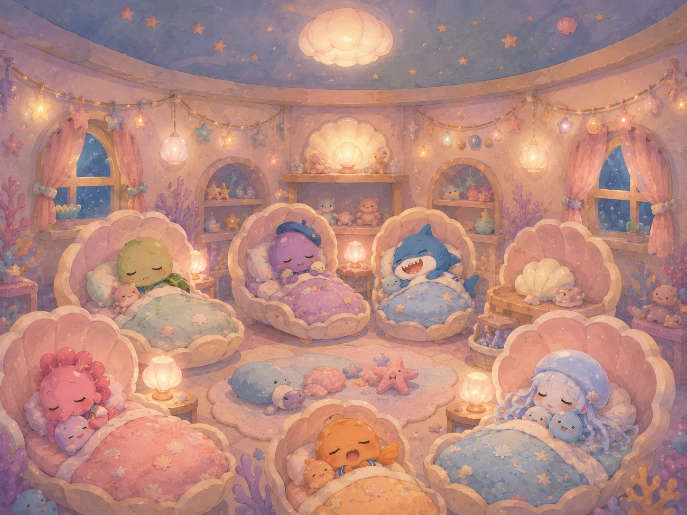

# 산호마을 어린이집 이미지 생성 규칙서

## 1. 목적

이 문서는 3세 대상 그림책 **「산호마을 어린이집」 시리즈**의 이미지를 일관되게 생성하기 위한 기준 규칙서다.  
어떤 이야기나 장면을 만들더라도 아래 원칙을 유지한다.

1. 따뜻하고 편안한 정서
2. 과한 디테일과 과한 채도를 줄인 차분한 화면
3. 등장인물의 외형 일관성 유지
4. 어린아이에게 안정감을 주는 부드러운 톤
5. 페이지마다 구도, 포즈, 시점이 반복되지 않도록 다양성 확보
6. 텍스트를 나중에 얹기 쉬운 여백 확보

### 공식 인물 레퍼런스 이미지

캐릭터의 기본 외형, 색감, 복장, 얼굴 비율, 이름표 스타일은 아래 이미지를 우선 기준으로 삼는다.


이미지 생성 시 이 레퍼런스는 **캐릭터 고정 기준**으로 사용한다.  
장면마다 포즈, 표정, 시점, 거리감은 바꿀 수 있지만, 각 인물의 기본 색, 복장, 실루엣, 성격 인상은 유지한다.

### 공식 배경 레퍼런스 이미지

어린이집 공간의 구조, 색감, 소품 밀도, 조명 분위기는 아래 배경 레퍼런스를 기준으로 삼는다.  
장면에 맞는 배경 이미지를 우선 참고하되, 인물이 잘 보이도록 복잡도는 필요에 따라 줄인다.

| 공간 | 레퍼런스 이미지 | 사용 기준 |
| --- | --- | --- |
| 전경과 놀이터 |  | 등원, 하원, 바깥 놀이, 어린이집 입구 장면 |
| 교실 |  | 놀이, 대화, 활동, 모임, 선생님과 아이들의 실내 장면 |
| 식당 |  | 점심, 간식, 식사 준비, 조개 접시와 둥근 식탁 장면 |
| 낮잠방 |  | 낮잠, 휴식, 조용한 감정 안정, 밤처럼 포근한 장면 |

---

## 2. 세계관과 배경

### 기본 설정

- 무대는 **햇살이 비치는 얕고 안전한 바닷속 어린이집**이다.
- 이름은 **산호마을 어린이집**이다.
- 깊고 어두운 심해가 아니라, 따뜻하고 생활감 있는 바다 마을처럼 보이게 한다.
- 현실적인 수중 묘사보다 **동화적이고 아늑한 어린이집 공간**을 우선한다.
- 물속에서도 아이들과 선생님이 자연스럽게 생활하는 판타지 설정을 부드럽게 받아들일 수 있어야 한다.

### 배경 요소

- 산호로 만든 집
- 조개 모양 침대
- 불가사리 장식
- 둥근 창문
- 조개 선반
- 모래빛 바닥
- 물방울 장난감
- 부드러운 해초 화분
- 조개 접시
- 어린이집 실내화장
- 아늑한 놀이방
- 말랑한 쿠션
- 바다 유리 같은 투명 소품
- 작은 종, 출석판, 낮잠방, 놀이방, 급식 공간

### 공간 분위기

- 정돈되어 있지만 완벽한 쇼룸처럼 보이지 않게 한다.
- 아이들이 실제로 생활하는 사랑스러운 어린이집 느낌을 유지한다.
- 소품은 적당히 배치하되 빽빽하거나 복잡하지 않게 한다.
- 인물이 잘 보이도록 배경은 부드럽게 단순화한다.

---

## 3. 아트스타일

### 기본 스타일

- 유아용 그림책 일러스트
- 부드러운 동화풍
- 단순화된 형태
- 둥글고 말랑한 실루엣
- 부드러운 수채화 또는 파스텔 일러스트 질감
- 차분하고 따뜻한 색면 중심

### 스타일 원칙

- 선은 날카롭지 않고 부드럽게 표현한다.
- 디테일은 절제한다.
- 질감은 따뜻하고 포근하게 만든다.
- 채색은 맑고 깨끗하되 채도가 지나치게 튀지 않게 한다.
- 아이들이 안정감을 느낄 수 있는 은은한 화면을 만든다.

### 피해야 할 표현

- 과도하게 반짝이는 하이라이트
- 복잡한 광원 효과
- 과한 입체감
- 성숙해 보이는 캐릭터 얼굴
- 날카로운 표정
- 과밀한 배경
- 눈부신 네온톤
- 과격한 액션 연출
- 공포스럽거나 혼란스러운 분위기
- 일본 애니메이션 포스터처럼 과장된 연출
- 지나친 SD 데포르메로 인한 조형 붕괴

---

## 4. 색감

### 전체 색조

전체 색감은 **저채도 파스텔 + 따뜻한 중간톤** 중심으로 구성한다.

### 권장 색상

- 민트그린
- 코랄핑크
- 살구색
- 크림색
- 하늘색
- 연보라
- 바다유리색
- 연노랑
- 부드러운 청록색
- 연한 모래색

### 색감 원칙

- 화면 전체가 강하게 튀지 않게 한다.
- 원색은 포인트로만 사용한다.
- 한 장면 안에서 색 수를 너무 많이 늘리지 않는다.
- 배경은 차분하게, 인물은 배경보다 약간 또렷하게 둔다.
- 감정이 중요한 장면은 채도보다 **명도와 따뜻함**으로 조절한다.

### 시간대별 색감

- **아침:** 맑은 크림빛, 산호핑크, 연하늘빛
- **활동 시간:** 따뜻한 파스텔 블루와 코랄
- **감정 조절 장면:** 차분한 민트, 베이지, 옅은 블루
- **점심:** 따뜻한 크림, 연노랑
- **낮잠:** 라벤더, 블루그레이, 연보라, 달빛 같은 부드러운 조명
- **하원:** 주황빛 노을, 연분홍, 금빛 산호색

---

## 5. 톤앤매너

### 전체 정서

- 사랑스럽고 부드럽다.
- 장난스럽지만 시끄럽지 않다.
- 소동이 있어도 무섭지 않고 귀엽다.
- 갈등이 있어도 따뜻하게 해결된다.
- 핵심은 **아이의 감정은 존중하지만, 분위기는 안전하다**이다.

### 감정 연출

- 울거나 떼쓰는 장면도 과격한 분노가 아니라 속상함, 고집, 서운함, 아직 마음이 큰 상태처럼 보이게 한다.
- 마리 선생님은 늘 안정감 있는 존재로 보여야 한다.
- 친구들은 비난보다 놀람, 걱정, 응원에 가까운 반응을 보인다.

### 정서 한 줄 요약

> 작고 엉뚱한 소동이 일어나도, 결국은 사랑과 이해 속에서 해결되는 따뜻한 어린이집.

---

## 6. 캐릭터 공통 규칙

- 모든 캐릭터는 유아 대상 그림책 캐릭터답게 둥글고 귀여운 형태를 가진다.
- 얼굴은 단순하고 읽기 쉬워야 한다.
- 눈은 크고 맑으며 감정이 잘 드러나야 한다.
- 손발, 지느러미, 촉수는 무섭지 않게 단순화한다.
- 기본적으로 작은 가방 또는 어린이집 원복 느낌의 복장 요소를 가진다.
- 복장은 통일감 있는 **세일러풍 어린이집복** 또는 그와 비슷한 원복 콘셉트로 간다.
- 표정은 기쁨, 속상함, 부끄러움, 놀람, 졸림, 고민, 안도, 뿌듯함처럼 한눈에 읽히게 한다.

---

## 7. 고정 캐릭터 시트

아래 설명은 공식 인물 레퍼런스 이미지와 함께 사용한다.  
이미지와 텍스트가 충돌할 경우, **큰 형태와 색감은 레퍼런스 이미지**, **성격과 장면 연출은 이 문서의 텍스트 규칙**을 우선한다.

### 마리 선생님

- 산호마을 어린이집의 인어 선생님.
- 긴 초록빛에서 청록빛 머리.
- 머리에 불가사리 머리핀.
- 밝고 다정한 큰 눈.
- 흰색 세일러풍 상의와 분홍색 앞치마.
- 앞치마에는 조개, 불가사리, 바다 소품 같은 작은 장식.
- 하반신은 초록빛 인어 꼬리.
- 차분하고 포근하며 아이들을 안심시키는 존재.
- 어떤 장면에서도 무섭거나 화난 인상으로 그리지 않는다.
- 아이와 눈높이를 맞추는 자세를 자주 사용한다.

자주 쓰는 포즈:

- 무릎을 낮추고 아이와 이야기하기
- 손을 펴서 부드럽게 안내하기
- 아이를 안아 주기
- 미소 지으며 지켜보기
- 종을 들고 인사하기

### 준이

- 파란색 아기 상어.
- 작은 체구, 둥글고 통통한 느낌.
- 큰 입과 또렷한 눈.
- 흰색 세일러복 상의, 파란 하의, 노란 가방.
- 활발하고 감정 표현이 크다.
- 고집이 생기면 입을 삐죽 내밀고 몸에 힘이 들어간다.
- 떼쓰는 장면에서도 무섭지 않고 귀엽게 보여야 한다.

떼쓰는 표현:

- 팔짱
- 입 삐죽
- 고개 돌리기
- 발 또는 지느러미 구르기
- 눈물 맺힘

해결 후 표현:

- 부끄러운 미소
- 해냈다는 뿌듯함
- 활짝 웃는 표정

### 토리

- 초록색 아기 거북이.
- 둥근 얼굴, 순한 눈, 작은 등껍질.
- 세일러풍 어린이집복과 노란 가방.
- 조심스럽고 착하며 약간 걱정이 많다.
- 걱정, 놀람, 안도, 조용한 웃음이 잘 어울린다.
- 몸을 조금 움츠리거나 손을 모으는 자세가 자연스럽다.

### 몽글이

- 보라색 아기 문어.
- 둥근 머리와 짧고 말랑한 촉수.
- 작은 베레모 또는 귀여운 머리 장식 가능.
- 세일러풍 옷과 노란 가방.
- 호기심이 많고 손이 많은 아이.
- 촉수로 박수치기, 놀라기, 그림 그리기, 장난감 잡기 같은 동작이 잘 어울린다.

### 수아

- 보라빛 아기 해마.
- 약간 졸린 듯한 부드러운 눈.
- 조용하고 차분한 인상.
- 세일러풍 복장과 작은 가방.
- 낮잠, 조용한 관찰, 부드러운 미소 장면에 잘 어울린다.

### 포포

- 하늘빛 아기 해파리.
- 투명한 둥근 머리와 흐르는 촉수 같은 머리칼.
- 맑고 순한 표정.
- 공중에 살짝 둥실 떠 있는 느낌.
- 흰색에서 하늘색 중심의 부드러운 색감.
- 낮잠, 꿈, 조용한 장면의 분위기를 예쁘게 만든다.

### 루루

- 분홍색 아기 해마.
- 사랑스럽고 애교 많은 인상.
- 큰 눈과 조그만 손짓.
- 분홍색 몸, 세일러풍 복장, 노란 가방.
- 기뻐하기, 손뼉치기, 기대하기, 응원하기에 적합하다.

### 아루

- 주황색 아기 물고기.
- 동그랗고 명랑한 얼굴.
- 활동적이고 장난스러운 인상.
- 기쁜 표정과 크게 반응하는 포즈가 잘 어울린다.
- 점프하듯 움직이거나 지느러미를 활짝 벌리는 자세가 자연스럽다.

### 방울이

- 아주 작은 파란 물방울 마스코트.
- 둥글고 단순한 얼굴.
- 작은 눈, 작은 입, 통통 튀는 동작.
- 놀람, 기쁨, 응원, 졸림 같은 리액션으로 장면의 감정을 보조한다.

---

## 8. 장면 설계 규칙

### 핵심 원칙

매 장면마다 **구도, 시점, 캐릭터 배치, 표정, 자세가 반복되지 않도록** 설계한다.

### 피해야 할 반복

- 매번 정면 구도
- 매번 인물들이 일렬로 서 있는 구성
- 매번 같은 미소
- 매번 같은 높이의 시점
- 매번 같은 배경
- 매번 마리 선생님이 오른쪽, 준이가 왼쪽에만 있는 반복

### 권장 시점

- 정면
- 살짝 위에서 내려다보기
- 아이 눈높이
- 낮은 시점
- 측면 구도
- 반원형 배치
- 멀리서 보는 전경
- 가까운 감정 클로즈업
- 실내와 실외 교차
- 활기찬 장면과 정적인 장면 교차

### 장면 유형 예시

1. 도입 전경
2. 실내 생활 장면
3. 감정 폭발 장면
4. 조용한 대화 장면
5. 감정 이해 장면
6. 방법 제시 장면
7. 실천 장면
8. 친구들의 반응 장면
9. 정서적 안정 장면
10. 따뜻한 마무리 장면

---

## 9. 페이지 레이아웃 규칙

사용자가 나중에 글자를 얹을 수 있도록 모든 이미지에는 **텍스트 공간**을 확보한다.

### 기본 규칙

- 모든 이미지에 적당한 여백을 남긴다.
- 하늘, 바다빛 벽, 모래 바닥, 단순한 실내 벽면처럼 텍스트를 얹기 쉬운 영역을 일부 확보한다.
- 주요 인물의 얼굴 위에 소품이 겹치지 않게 한다.
- 너무 꽉 찬 구도는 피한다.
- 중요한 장면일수록 중앙 초점은 분명하게 두고 주변은 정리한다.

### 텍스트 공간 위치 예시

- 상단 왼쪽 빈 공간
- 상단 중앙 여백
- 오른쪽 벽면
- 앞쪽 바닥 공간
- 창문 주변의 밝은 여백
- 하늘빛 배경 부분

---

## 10. 항상 유지할 디자인 원칙

1. 마리 선생님은 늘 안전하고 다정한 존재로 그린다.
2. 준이는 떼를 써도 무섭지 않고 귀엽게 그린다.
3. 친구들은 관객이 아니라 함께 살아 있는 반응을 보여준다.
4. 배경은 어린이집 생활공간처럼 정감 있게 표현한다.
5. 색감은 차분하고 따뜻하게 유지한다.
6. 과한 장식보다 읽기 쉬운 화면을 우선한다.
7. 아이의 감정은 존중하되 결말은 안정적으로 만든다.
8. 소동은 작고 사랑스럽게 표현한다.
9. 한 장면만 보아도 이야기 감정이 명확하게 읽히게 한다.
10. 각 장면은 독립된 삽화로도 이해 가능해야 한다.

---

## 11. 기본 공통 프롬프트

```text
산호마을 어린이집 그림책용 일러스트를 생성한다.
3세 대상 유아 그림책 스타일.
전체 아트스타일은 디테일을 단순화한 부드러운 동화풍 수채화 일러스트,
차분하고 따뜻한 파스텔 색감,
둥글고 말랑한 캐릭터 조형,
안정감 있고 사랑스러운 분위기로 표현한다.

배경은 햇살이 비치는 따뜻한 바닷속 어린이집.
산호, 조개, 불가사리, 둥근 창문, 조개 침대, 모래빛 바닥,
어린이집 가구와 장난감 같은 바다 테마 생활공간을 포함한다.
배경은 디테일을 지나치게 복잡하게 하지 말고,
인물이 잘 보이도록 부드럽고 정돈되게 표현한다.

등장인물은 다음 설정을 유지한다.

- 마리 선생님: 긴 초록빛 머리, 불가사리 머리핀, 큰 다정한 눈,
  흰색 세일러풍 상의와 분홍색 앞치마, 초록빛 인어 꼬리.
  늘 부드럽고 따뜻한 인상.
- 준이: 파란색 아기 상어, 세일러풍 어린이집복, 노란 가방.
  감정 표현이 크고 활발함.
- 토리: 초록색 아기 거북이, 세일러풍 옷, 노란 가방,
  순하고 걱정 많은 인상.
- 몽글이: 보라색 아기 문어, 세일러풍 옷, 노란 가방,
  호기심 많은 성격.
- 수아: 보라빛 아기 해마, 세일러풍 옷, 차분하고 졸린 듯한 인상.
- 포포: 하늘빛 아기 해파리, 맑고 순한 표정, 둥실 떠다니는 느낌.
- 루루: 분홍색 아기 해마, 애교 많고 사랑스러운 인상.
- 아루: 주황색 아기 물고기, 밝고 명랑한 인상.
- 방울이: 작은 파란 물방울 마스코트, 통통 튀는 표정.

중요 규칙:
- 색은 너무 과하게 튀지 않게 한다.
- 네온톤, 과한 반짝임, 과한 디테일을 피한다.
- 유아용 그림책답게 부드럽고 편안해야 한다.
- 장면마다 구도, 시점, 포즈, 표정이 반복되지 않게 한다.
- 인물의 감정이 한눈에 읽히게 한다.
- 사용자가 나중에 글자를 넣을 수 있도록 적당한 여백을 확보한다.
- 화면이 너무 복잡하거나 빽빽하지 않게 한다.
```

---

## 12. 장면 생성 템플릿

아래 템플릿에서 장면별 항목만 바꿔 사용한다.

```text
위의 산호마을 어린이집 공통 규칙을 모두 유지한다.
이번 장면은 다음 내용을 표현한다:

[장면 설명]

추가 연출 규칙:
- 이 장면의 핵심 감정은 [핵심 감정]
- 중심 인물은 [중심 인물]
- 배경 장소는 [장소]
- 화면에 텍스트를 넣을 여백은 [여백 위치]
- 구도는 이전 장면과 겹치지 않게 [원하는 구도]
- 표정과 자세는 감정이 분명히 읽히도록 [표정/행동]
- 전체 분위기는 [따뜻함/조용함/소동/안정감 등]
```

---

## 13. 반복 방지 지시문

```text
각 장면은 이전 장면들과 구도, 시점, 카메라 거리, 인물 배치, 표정, 포즈가 최대한 겹치지 않도록 설계한다.
같은 정면샷과 같은 자세를 반복하지 않는다.
어떤 장면은 넓은 전경, 어떤 장면은 중간샷, 어떤 장면은 가까운 감정 장면으로 변화를 준다.
인물의 위치도 매번 바꾸고, 실내와 실외, 활동 장면과 조용한 장면의 리듬을 조절한다.
```

---

## 14. 색감 고정 지시문

```text
전체 색감은 과하게 화려하거나 채도가 튀지 않게 하고,
차분하고 따뜻한 파스텔 중심으로 통일한다.
민트, 코랄, 크림, 하늘색, 연보라, 살구색 중심의 부드러운 색조를 사용한다.
네온색, 과도한 반짝임, 과밀한 디테일은 피한다.
```

---

## 15. 마스터 규칙 블록

```text
산호마을 어린이집 마스터 이미지 규칙

- 3세 대상 유아 그림책 일러스트
- 부드러운 동화풍 수채화 스타일
- 디테일 단순화
- 차분하고 따뜻한 파스텔 색감
- 네온톤, 과한 채도, 과한 반짝임 금지
- 둥글고 말랑한 캐릭터 조형
- 감정이 한눈에 읽히는 명확한 표정
- 배경은 바닷속 어린이집 생활공간
- 산호, 조개, 불가사리, 둥근 창문, 조개 침대, 모래빛 바닥, 어린이집 가구 포함
- 인물보다 배경이 튀지 않게 할 것
- 텍스트 삽입용 여백 확보
- 장면마다 구도, 시점, 포즈, 거리감, 배치를 반복하지 말 것
- 갈등 장면도 무섭지 않고 귀엽고 안전하게 표현할 것
- 선생님은 늘 따뜻하고 안정적인 존재로 묘사할 것
- 아이들의 작은 감정 변화가 중요한 그림책 톤 유지

고정 캐릭터:
- 마리 선생님: 초록 머리, 불가사리 머리핀, 분홍 앞치마, 인어 꼬리, 따뜻한 미소
- 준이: 파란 아기 상어, 세일러복, 노란 가방, 감정 표현 큼
- 토리: 초록 아기 거북이, 순한 눈, 세일러복, 노란 가방
- 몽글이: 보라 아기 문어, 세일러복, 노란 가방, 호기심 많음
- 수아: 보라빛 아기 해마, 차분하고 졸린 인상
- 포포: 하늘빛 아기 해파리, 맑고 순한 분위기
- 루루: 분홍 아기 해마, 애교 많고 사랑스러움
- 아루: 주황 아기 물고기, 명랑하고 활발함
- 방울이: 작은 파란 물방울 마스코트
```
